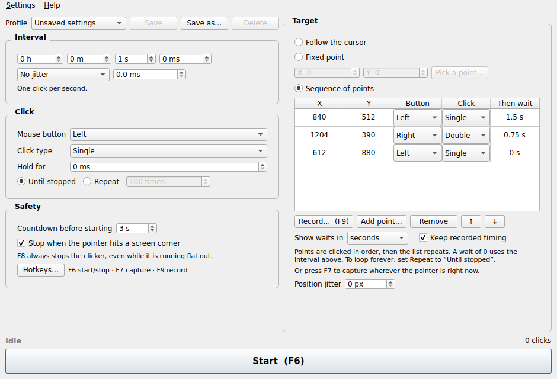

# Autoclicker

Clicks for you, on a timer. Set an interval, pick where to click, press a
hotkey. It runs on macOS and Windows.



*The window follows your system's appearance, so it will look like a Mac app on
a Mac and a Windows app on Windows.*

---

## Install

### macOS

1. Go to the [**Releases** page](../../releases) and download
   `Autoclicker-macOS-AppleSilicon.zip` from the newest release.
2. Double-click the zip to unpack it, then drag **Autoclicker** into your
   **Applications** folder.
3. Double-click Autoclicker. **macOS will refuse to open it** — that is
   expected, and the next step fixes it.
4. Open **System Settings → Privacy & Security**, scroll down to **Security**,
   and click **Open Anyway** next to the message about Autoclicker. Enter your
   password. The app opens.

> The **Open Anyway** button only appears for about an hour after you tried to
> open the app. If it is not there, double-click Autoclicker again and go
> straight back to Settings.

**Then grant two permissions.** Without them the app opens but does nothing at
all. Both are in **System Settings → Privacy & Security**:

| Permission | Why it is needed |
|---|---|
| **Accessibility** | To send clicks |
| **Input Monitoring** | For the hotkeys to work while other apps are in front |

Switch Autoclicker on in both lists, then quit and reopen the app. Autoclicker
will offer to open the right settings page for you if it notices a permission
is missing.

### Windows

1. Go to the [**Releases** page](../../releases) and download
   `Autoclicker-Windows.zip` from the newest release.
2. Right-click the zip → **Extract All**, and put the folder somewhere you will
   find it again, such as your Documents folder.
3. Open the folder and run **Autoclicker.exe**.
4. Windows will show a blue "Windows protected your PC" box. Click **More
   info**, then **Run anyway**.

No permissions to grant. One exception: Windows will not let a normal program
click inside a window that is running as administrator. If your target app runs
as administrator, right-click Autoclicker and **Run as administrator** too.

### Which Mac do I have?

Click the Apple menu → **About This Mac**. If the chip says **Apple M1, M2, M3**
or newer, the download above is right. If it says **Intel**, these builds will
not run — see [Running from source](#running-from-source).

---

## Why the scary warnings?

The app is not signed with a paid Apple or Microsoft developer certificate, so
both systems say they cannot verify who made it. That is the *only* thing they
are telling you — not that anything is wrong with the app.

One practical consequence on macOS: it ties permissions to the exact app file,
and every unsigned update is a different file as far as macOS is concerned. **So
you will have to grant Accessibility and Input Monitoring again after each
update.** Annoying, and only a paid Apple Developer ID fixes it properly.

---

## Using it

### The basics

1. **Interval** — how long to wait between clicks, in hours, minutes, seconds
   and milliseconds. It starts at one click per second.
2. **Click** — which mouse button, single or double click, and whether to repeat
   forever or a set number of times.
3. **Target** — where to click. Either follow your cursor wherever it goes, or
   lock a fixed point on screen, or run through a list of points in order.
4. Press **Start**, or the `F6` key.

### Hotkeys

These work even when Autoclicker is behind another window.

| Key | What it does |
|---|---|
| `F6` | Start and stop |
| `F7` | Remember wherever the pointer is right now as the target |
| `F8` | **Panic stop** — always works, even mid-run |
| `F9` | Start and stop recording a sequence |

Change any of them with the **Hotkeys…** button in the Safety panel.

> On a Mac you may need to hold `Fn` while pressing the F-keys, unless you have
> turned on "Use F1, F2, etc. as standard function keys" in System Settings →
> Keyboard.

### If it runs away from you

A fast clicker eats the click you are trying to land on the Stop button. Three
things always stop it:

- Press `F8`.
- Slam the pointer into any corner of any screen.
- Set a **Repeat** count instead of "Until stopped", so it stops on its own.

### Clicking one fixed spot

Choose **Fixed point**, click **Pick a point…**, and the screen dims with a
crosshair. Click where you want, and that spot is locked in. Or just hover over
the spot and press `F7`.

### Recording a sequence of clicks

This is the one worth knowing about. Instead of typing in coordinates, perform
the task once and Autoclicker copies it.

1. Choose **Sequence of points**.
2. Press **Record…** (or `F9`).
3. Click your way through whatever you want repeated. Your buttons,
   double-clicks and the pauses between them are all captured. Clicking on the
   Autoclicker window itself is ignored.
4. Press `F9` again to stop.
5. Set **Repeat** to **Until stopped** and press **Start**. It loops forever.

Untick **Keep recorded timing** if you would rather every step used the interval
at the top instead of your own pauses.

### Saving your setup

The **Profile** row at the top saves everything as a named profile — **Save
as…**, and pick it from the list next time. The last one you used comes back
automatically when you reopen the app.

### Other bits worth knowing

- **Jitter** adds a little randomness to the timing and position, so the clicks
  are not machine-perfect.
- **Position jitter** scatters each click a few pixels around the target.
- The **menu bar icon** (macOS) or **tray icon** (Windows) lets you start and
  stop without the window. Turn on **Settings → Keep running when the window
  closes** to keep it going with the window shut.
- The counter at the bottom right shows the click rate you are *actually*
  getting, which below about 5 ms is slower than what you asked for. That is
  the operating system's limit, not the app's.

---

## Troubleshooting

**Nothing happens when I press Start.** On macOS this is almost always a missing
permission. Check **Help → Permissions…** in the app.

**The hotkeys do nothing.** Input Monitoring is not granted, or another app has
claimed the same key. Try a different key under **Hotkeys…**.

**It worked before the update and now it does not.** macOS forgot the
permissions because the new version is a new file. Grant Accessibility and Input
Monitoring again.

**Clicks land in the wrong place.** Rare, and there is a built-in check:
`Autoclicker --check-pointer` from a terminal reports how long your machine
takes to move the pointer. If you would rather not, just say so and it can be
looked into.

**A game or website says autoclickers are not allowed.** Then they are not
allowed — plenty of services forbid them in their terms of service. Where you
point this is your call.

---

## Running from source

For Intel Macs, Linux, or if you would rather not use a packaged build. Needs
[uv](https://docs.astral.sh/uv/getting-started/installation/).

```bash
git clone git@github.com:Kaaykun/autoclicker.git
cd autoclicker
uv sync
uv run autoclicker
```

`uv sync` creates the environment, fetches the right Python version and installs
everything from the lockfile. Nothing to activate.

Running this way, macOS attaches the permissions to your **terminal** rather
than to the app, so they survive updates.

There is also a headless mode for scripting:

```bash
uv run autoclicker --cli --ms 250 -n 20 --button right --dry-run
uv run autoclicker --cli --seconds 1 --at 840 500 --jitter-percent 15
uv run autoclicker --cli --check-pointer
```

---

## For developers

<details>
<summary>Layout, tests, and building the packaged app</summary>

### Layout

```
autoclicker/
├── core/        # engine, config, timing, input backends — no Qt imports
├── ui/          # PySide6 widgets — no timing-critical work
└── resources/   # artwork
tools/           # icon build, frozen-app launcher
docs/            # design plan, manual test checklist
```

`core/` is Qt-free and fully testable headless. The click backend is injectable,
so the test suite never fires a real click. The GUI tests build real widgets
against Qt's offscreen platform plugin, so they need no display.

### Tests and linting

```bash
uv run pytest
uv run ruff check .
```

### Dependencies

`uv add <pkg>` for runtime, `uv add --dev <pkg>` for tooling. Both update
`pyproject.toml` and `uv.lock` together — commit both. CI syncs with `--locked`
and fails if they disagree.

The Qt dependency is `PySide6-Essentials`, not the full `PySide6`: only QtCore,
QtGui and QtWidgets are imported, and the Addons half is several hundred
megabytes that would otherwise sit inside every packaged build.

### Building the app

```bash
uv run python tools/make_icons.py     # once, or after changing the artwork
uv run pyinstaller autoclicker.spec
```

Output lands in `dist/`.

### Cutting a release

The version lives in three places and CI fails the build if they disagree:

```bash
# 1. Bump the version in BOTH pyproject.toml and autoclicker/__init__.py
# 2. Re-lock, because uv.lock records the project's own version:
uv lock
# 3. Check it before pushing — this is what CI does:
uv lock --check && uv run pytest -q && uv run ruff check .
# 4. Commit everything including uv.lock, then tag:
git commit -am "Release vX.Y.Z"
git push
git tag vX.Y.Z && git push origin vX.Y.Z
```

GitHub Actions then builds both platforms and attaches them to a release.
Skipping step 2 is the easy mistake: `uv sync --locked` refuses to run and every
job fails before it reaches the tests.

### Icons

`autoclicker/resources/icon.png` is the 1024×1024 master.
`tools/make_icons.py` gives each platform what it actually wants:

- **macOS** keeps the rounded artwork, inset onto Apple's 824-in-1024 grid so it
  matches its neighbours in the Dock. macOS does not mask app icons, so the
  rounded corners must be in the file.
- **Windows** gets a squared, full-bleed variant. Windows does not mask icons
  either and has no corner convention, so baked-in rounded corners show up as
  transparent notches against a taskbar highlight. The tool extends the
  background gradient outward into the corners rather than filling them flat.

### Documentation

- [docs/PLAN.md](docs/PLAN.md) — architecture, design decisions, milestones
- [docs/manual-testing.md](docs/manual-testing.md) — what CI cannot check

</details>

---

## License

MIT — see [LICENSE](LICENSE).
